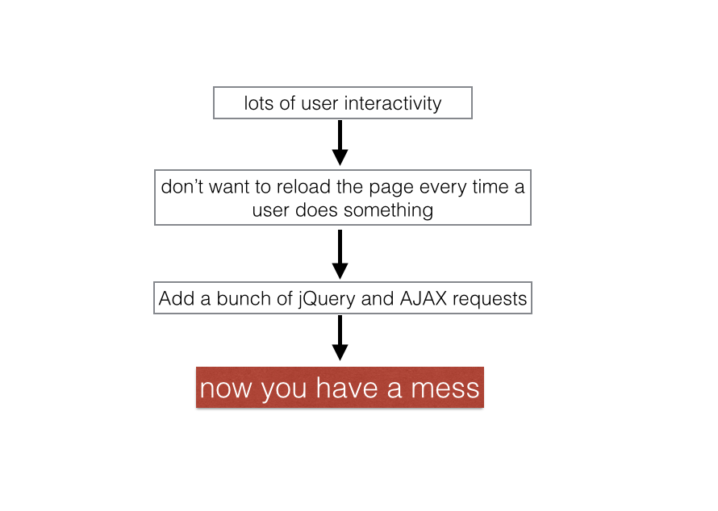
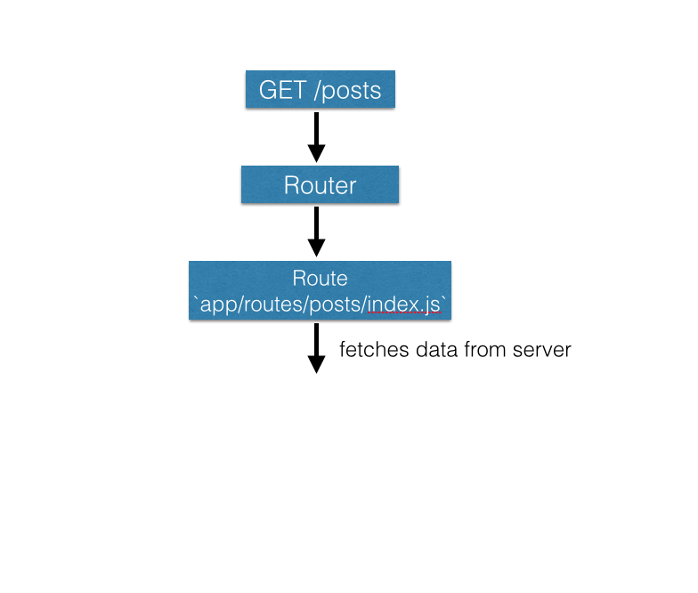
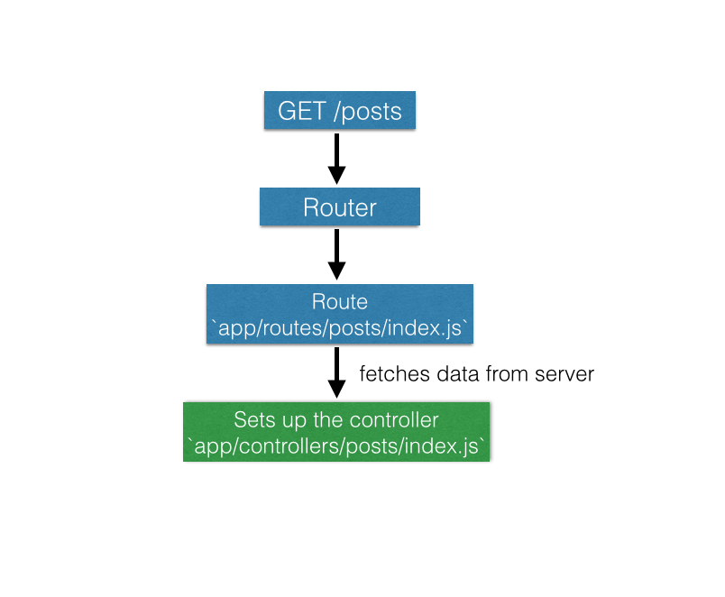
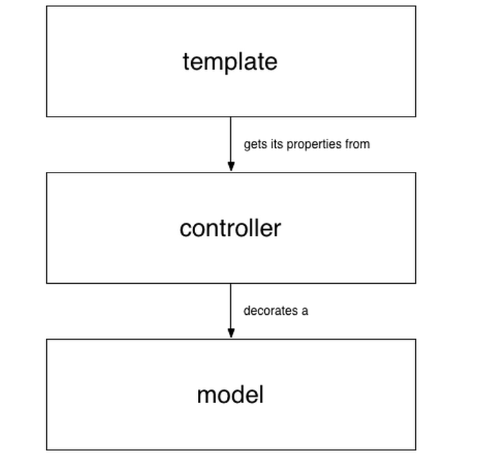
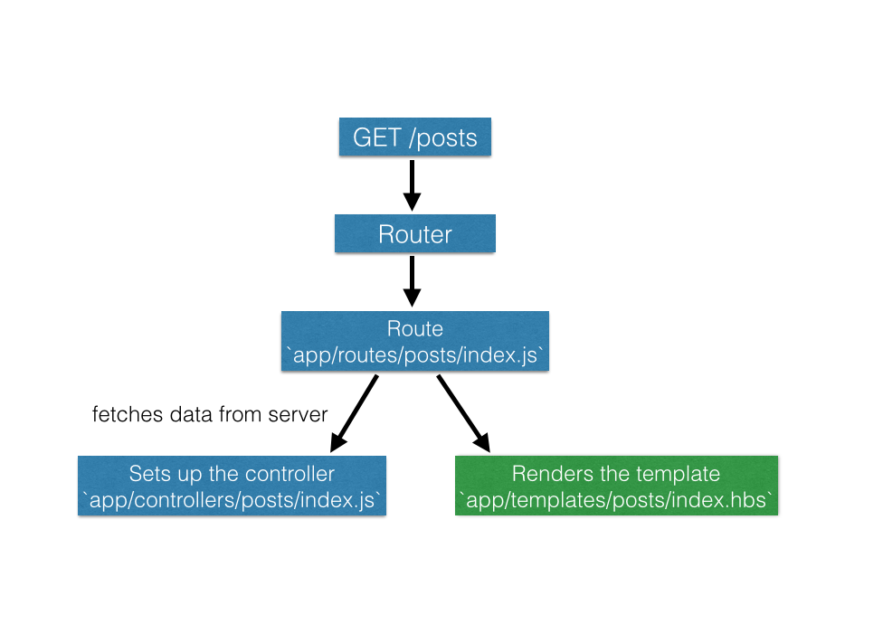
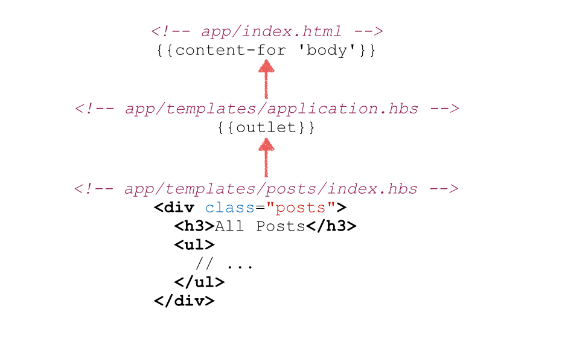

# Ember 101

## WTH is Ember and what does it do?

---

# What is Ember?

JavaScript MVC framework for building web apps

^It can also be used with Cordova / PhoneGap to build native iOS and Android apps using HTML, CSS, and JavaScript

---

# I don't know what that means.

^If you’re familiar with Rails, think of a JavaScript MVC framework as a mirror of your Rails app with the same basic components, just in JavaScript and running in the browser instead of on the server.

^Specifically, Ember has the following major components, each of which we’ll go into in more depth:

---

# Components of (Ember's) MVC framework

*Router* - translates the URL into some application state
*Models* - objects with properties and methods
*Routes* - retrieve data & render templates
*Controllers* - like decorators in Rails
*Templates* - HTML that is dynamically updated based on the application's state

^Not all JavaScript frameworks have all of these components. React, for example, only really deals with data binding in the view.

---

## Why use a JavaScript framework?
## What's wrong with Rails?

^Ember doesn't necessarily let you do additional things that you couldn't do in Rails

^But it does make the user experience a lot nicer in certain circumstances.

^Say you have some app that has a lot of user interactions it needs to respond to.

---



---

## OK fine.
## But why Ember?

---

Because they have the best KoolAid

---

Because they have the best KoolAid

lol j/k

---

# Why Ember?

* Convention-driven

^highly convention-driven

^Yehuda Katz on the Rails core team, took idea from there

^frameworks should give developers some set of conventions around things like naming, directory structures, etc. that allow the framework to do a lot of the boilerplate work so you don’t have to.  

^It also means that it’s much easier for new developers to jump into a project because they know where everything is.  That’s not the case for other JavaScript frameworks nearly to the degree that it is for Ember.

---

# Why Ember?

* Convention-driven
* Router

^Ember was built around this idea that what makes the web special is the ability to share content via a URL

^Should be able to copy a URL and send it to a friend and they should see the exact same page you did.  

^straight ahead with a Rails app that refreshes the page all the time, but when you start having lots of JavaScript running on a page it might not be

^Ember has done a lot of work on the router to make sure that URLs cleave closely to what you see on the page

---

# Why Ember?

* Convention-driven
* Router
* Nice tools like `ember-cli`

^nice build tools and libraries, specifically `ember-cli`

^command-line-interface tool that, very similar to the rails command line interface, lets you run commands like `ember new` to create a new ember app, or a series of generators to create things like models, controllers, routes, and acceptance tests.

---

# Why Ember?

* Convention-driven
* Router
* Nice tools like `ember-cli`
* The community

^The leadership is very thoughtful and deliberate about thinking through the future of the framework and how to develop it

^energetic & excited open source community

---

## That's all very nice.
## So how does it work?

---

# Directory Structure

```bash
$ ember new demo-app

demo-app/
├── app/
|   ├── routes/
|   ├── models/
|   ├── controllers/
|   ├── components/
|   ├── templates/
|   ├── router.js
|   ├── app.js
|   └── index.html
├── tests/
|   ├── acceptance/
|   └── unit/
└── dependencies, config, & other stuff
```
^Let’s first take a look at the directory structure of an `ember-cli`-generated app so we get a sense of where stuff is, and then I’ll go through each major component of Ember and what it does

^most code goes in your `app/` directory, similar to a Rails app

^The important pieces we’ll look at are: the router (that router.js file), plus routes, models, controllers, and templates.  We'll also touch briefly on components towards the end.

^The `app.js` loads in all your initializers and sets up the app in the browser.  

^The `index.html` is the single html file into which all the other pieces of DOM are loaded as you navigate to different "pages" (really, routes) in the app.  You may have heard JavaScript apps referred to as "single page applications" — that’s what they’re referring to.

^Before we walk through the major directories, let’s take a look at that file first.

---

# app/index.html

```hbs
<!DOCTYPE html>
<html>
  <head>
    <meta charset="utf-8">
    <meta http-equiv="X-UA-Compatible" content="IE=edge">
    <title>DemoApp</title>
    <meta name="description" content="">
    <meta name="viewport" content="width=device-width, initial-scale=1">

    {{content-for 'head'}}

    <link rel="stylesheet" href="assets/vendor.css">
    <link rel="stylesheet" href="assets/demo-app.css">

    {{content-for 'head-footer'}}
  </head>
  <body>
    {{content-for 'body'}} // this is where your templates go

    <script src="assets/vendor.js"></script>
    <script src="assets/demo-app.js"></script>

    {{content-for 'body-footer'}}
  </body>
</html>
```

^You can think of this kind of like your application layout file in a Rails app (well, either this or `app/templates/application.hbs`). It sets up the boilerplate for an HTML document, and has placeholders where other DOM elements will be inserted, the primary one being the `{{content-for ‘body’}}`.

---

# Ember vs. Rails

^OK so let’s get into the guts of an Ember app.

^Ember has a whole lot of pieces that are kind of hard to understand how they fit together without some sort of analogy.  So we're going to compare Ember to Rails here.  Sorry folks who don't know Rails. I'm going to try to explain what each piece does in a way that people who haven't done Rails can understand, but if I've totally lost you just pipe up and ask for clarification.

---
# Ember vs. Rails

# `GET /posts`

^For purposes of demonstration, let's imagine we have a simple blogging app and let's walk through what would happen when we navigate to the /posts URL in our app. And how that work be handled in an Ember app vs. a Rails app.

---

# The Router

```javascript
// app/router.js

Router.map(function() {
  this.resource('posts', function() {
    this.route('show', { path: ':id' });
  });
});
```

```ruby
# config/routes.rb

Rails.application.routes.draw do
  resources :posts, only: [:index, :show]
end
```

^So when I first navigate to a URL in the browser, I hit the Ember app's router.  This is kind of analogous to the Rails router.  If I have an app with routes set up to `GET /posts` to show a list of posts and `GET /posts/:id` to show a single post’s details, here's how that would look in Ember on top and then in Rails.

^In a Rails app, when you hit your router you're directed to a controller action, whose responsibility it is to fetch data from the model and render some template.

^In an Ember app, the same basic function is provided by a route.  

^NAMING IS BAD. Router =/= route.

---

# Routes

```javascript
// app/routes/posts/index.js

export default Ember.Route.extend({
  model: function() {
    return this.store.find('post');
  }
});
```

```ruby
# app/controllers/posts_controller.rb

class PostsController < ApplicationController
  def index
    @posts = Post.all
  end
end
```

^These are doing roughly the same things.  The major difference is that in an Ember app, you're actually making an asyncronous call to get data.

^`this.store.find()` uses a library called `ember-data` that comes packaged with `ember-cli` to make an AJAX call to your backend for all `post` records.

^Once that AJAX request has been completed, the route then translates the JSON it gets back into a bunch of Ember `post` objects using an ember `post` model.  So let's take a look at that model now.

---

# Models

```javascript
// app/models/post.js

import DS from 'ember-data';

export default DS.Model.extend({
  title: DS.attr('string'),
  body: DS.attr('string')
});
```

```ruby
# app/models/post.rb

class Post < ActiveRecord::Base
end
```

^Ember models are also based on the `ember-data` library and allow you to set attributes that match your ActiveRecord model's attributes (assuming you have a Rails API backend). So assuming our `Post` model in our backend has title and body attributes, here's how we'd set up the corresponding ember model

---

# Models

```javascript
// app/models/post.js

import DS from 'ember-data';

export default DS.Model.extend({
  // ...

  author: DS.belongsTo('user', { async: true }),
  comments: DS.hasMany('comment', { async: true })
});
```

```ruby
# app/models/post.rb

class Post < ActiveRecord::Base
  belongs_to :author, class_name: 'User'
  has_many :comments
end
```

^`ember-data` also lets you set associations with other models.  So if you have some an `author_id` in the JSON you send back for a post, it will fetch JSON for the user and create a user object using the `User` model you would have created in your Ember app

^Same for a `has_many` association.  If a post has_many comments and you include an array of `comment_ids` in your JSON for a post, Ember will fetch the data for those

^ async: true has to do with eager loading records

---

# Models

```javascript
// app/models/post.js

import DS from 'ember-data';

export default DS.Model.extend({
  // ...

  commentCount: function() {
    return this.get('comments').length;
  }.property('comments')
});
```

```ruby
# app/models/post.rb

class Post < ActiveRecord::Base
  # ...

  def comment_count
    comments.length
  end
end
```

^In addition to setting properties and associations on a model, ember-data lets you create something called computed_properties that are kind of like instance methods in an ActiveRecord model

^look like regular JavaScript functions but you call `.property` on them and pass in the properties it needs from the model.

---

# Recap



^To quickly recap what we’ve talked about: We navigate to the posts index URL in our app, it hits the Ember router which goes to find the correct route for that URL.  The route then fetches the data from the server via an AJAX request and builds the necessary ember-data models.

^OK, so now that you’ve loaded your data, what does Ember do with it? We know eventually the route is going to render a template.  However, in the current version of ember, there’s this intermediary object that the route deals with called a controller.

---

# Recap




^This is NOT a controller like we might think of in Rails.  It’s really more like a decorator.  It's an object that you set a bunch of properties on that the view can then access.  Most notably, the route will set a property called `model` on the controller that contains your model object or objects.

^Now, I’m not going to go into huge depth on controllers here.  They are probably the least important thing for you to understand in this presentation, for two reasons: (1) you often don't need to create them yourself. In fact, in building simple CRUD apps I’ve hardly ever manually created my own controllers. Ember will generate a controller under the hood for you if you haven't created a controller for a particular routes. (One potential use case: set a `canEdit` property that tells you whether the current user can edit a post.) (2) Also very notably, controllers are going away in Ember 2.0, which is coming in mid-June, in favor of moving its functionality into the route, components, or service objects.

---

# Controllers



###### source: [http://guides.emberjs.com/v1.10.0/controllers/](http://guides.emberjs.com/v1.10.0/controllers/)

---

# Moving on.

# Templates!

---




^OK so the route has fetched the model and setup the controller. Now it goes to find the right template.  In this case using Ember's conventions it's going to look for a template in `app/templates/posts/index.hbs`.

^Let's take a look at those templates

---
# Templates

```hbs
<!-- app/templates/posts/index.hbs -->

<div class="posts">
  <h3>All Posts</h3>

  <ul>
    {{#each post in model}}
      <li>
        {{link-to post.name 'posts.show' post}}
      </li>
    {{/each}}
  </ul>
</div>
```

^Ember's templates contain the actual HTML that is rendered in the browser.  Ember uses a templating engine called HTMLBars, which uses those double curlies to dynamically render data into these templates.

^Historical note: used Handlebars prior to 1.10. HTMLBars is smarter, faster, and doesn't litter your markup with `<script>` tags the way Handlebars did.  

---

# Templates

```hbs
<!-- app/templates/posts/index.hbs -->
<ul>
  {{#each post in model}}
    <li>{{link-to post.name 'posts.show' post}}</li>
  {{/each}}
</ul>
```

```html
<!-- app/views/posts/index.html.erb -->
<ul>
  <% @posts.each do |post| %>
    <li><%= link_to post.name, post %></li>
  <% end %>
</ul>
```

^For the Rails folks, you can think of templates as views, or partials. And HTMLBars is like your ERB or Haml.

^It gives you nice helpers like each, if, and link_to.  So for example this code about will generate an unordered list of links to each post's route.

^So there's just one more thing I want to touch on with templates, and that is...

---

# How are templates rendered in a single-page application?

^we've just got that one index.html file, so how does Ember know where to insert these templates?

---

# Outlets

---



^For Rails people, this is kind of like rendering a partial. In this case, the template at the bottom is inserted into the main application template, application.hbs, which is itself rendered into the single index.html file in the content-for body.

^you can also have multiple named outlets, and just specify on your route the outlet where the template should be inserted.

---

# That's it!

## Now you know Ember

^We've covered how a GET request moves through the system.  

^But obviously there's not much user interaction going on when you're doing a simple GET request, and that's what we said Ember is intended for.  

---

# Action handling

^So how do we respond to user actions such as creating a new post, commenting on a post, or favoriting a post?

^We can do that by specifying an action either on our controller or our route. (Or on a component - which we'll get to later)

---

# Creating a new post

```javascript
// app/routes/posts/new.js

export default Ember.Route.extend({
  model: function() {
    return this.store.createRecord('post');
  },
  actions: {
    save: function() {
      var _this = this;
      var model = this.currentModel;

      model.save().then(function() {
        _this.transitionTo('post.show', model);
      }, function() {
        // Failed!
      });
    }
  }
});
```

^Here's the route for the "new post" form - `GET /posts/new`. It builds a new post object as the model using `createRecord`.

^Inside the `actions` property we can set whatever actions we want. In this case `save` will grab the model, use the `ember-data` to generate an AJAX request to save the model (`model.save()`) and then, when that promise has resolved, will transition to the post's details page.

---

# Creating a new post

```hbs
<!-- app/templates/posts/new.hbs -->

<form {{action 'save' model on='submit'}}>
  <div>
    {{input name="name" value=model.name placeholder='Enter post name'}}

    {{#each error in model.errors.name}}
      <p>{{error.message}}</p>
    {{/each}}
  </div>

  <div>
    {{input name="body" value=model.body placeholder='Enter post body'}}
  </div>

  <div>
    <input type="Submit" class="button">
  </div>
</form>
```

^When this form submits, it will trigger the `save` action on the route.

---

# Components

## Reusable UI elements

^Components are a way of creating reusable UI elements and are going to take over some of the functionality of controllers when they go away.

^Use cases: topbar or sidebar navigation, list item, etc.

^Let's look at a topbar navigation component.

---

# Topbar navigation

```javascript
// app/components/topbar-nav.js
export default Ember.Component.extend({
  tagName: 'nav',
  classNames: ['topbar-nav']
});

```

```hbs
<!-- app/templates/components/topbar-nav.hbs -->
<ul>
  <li>My Awesome Blog</li>
  <!-- sign up / in / out links -->
</ul>
```

```hbs
<!-- app/templates/application.hbs -->
{{topbar-nav}}

{{outlet}}
```

^Three parts to using a component: (a) the component itself, which specifies the wrapper tag for the element, any class names, actions, and other things; (b) the template; (c) rendering the component template inside some other template.

---

# Ember 2.0

^Touch on Ember 2.0: Glimmer - DOM-diffing React-style; FastBoot; new versions of ember-cli, liquid Fire, I think Ember data; routeable components
^None of this is really new - you can play around with it in the beta & canary branches.
^Check out the Ember RFCs repo, which contains proposals for upcoming features. Specifically check out routeable components RFC. https://github.com/emberjs/rfcs

---

# Resources

Ember guides: [http://guides.emberjs.com/v1.11.0/](http://guides.emberjs.com/v1.11.0/)
DockYard `ember-cli` / `rails-api` tutorial: [http://reefpoints.dockyard.com/2014/05/07/building-an-ember-app-with-rails-part-1.html](http://reefpoints.dockyard.com/2014/05/07/building-an-ember-app-with-rails-part-1.html)
Ember CLI 101 book: [https://leanpub.com/ember-cli-101](https://leanpub.com/ember-cli-101)
Frontside podcast: [https://frontsidethepodcast.simplecast.fm/](https://frontsidethepodcast.simplecast.fm/)
Check out the code for some apps built in Ember: [emberobserver.com code](https://github.com/emberobserver/client), [demo app I built](https://github.com/hchood/masterminder)

---

# Questions?
